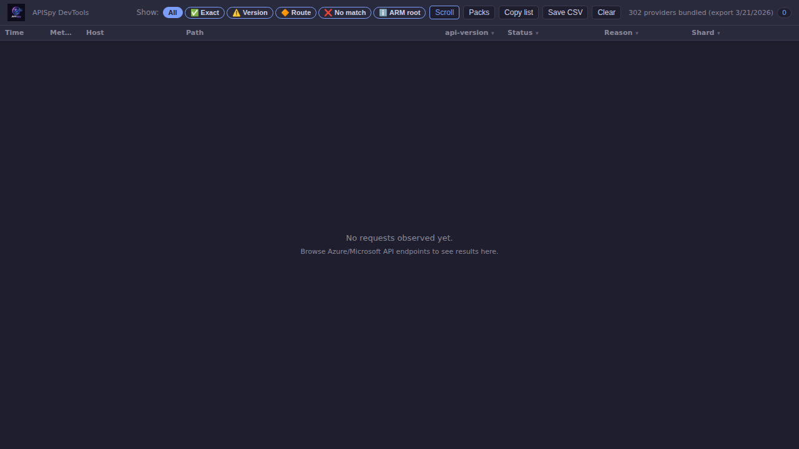
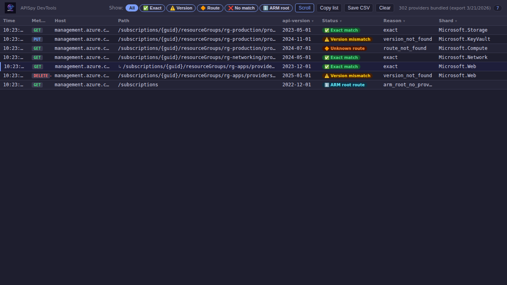
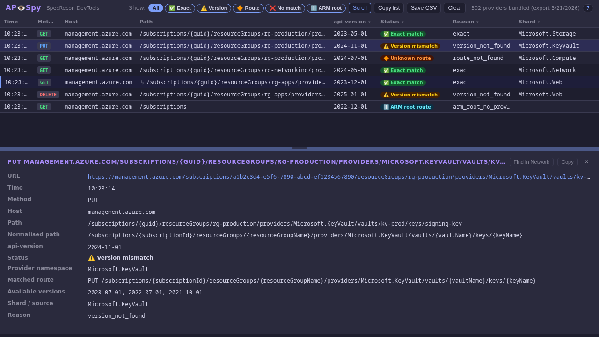
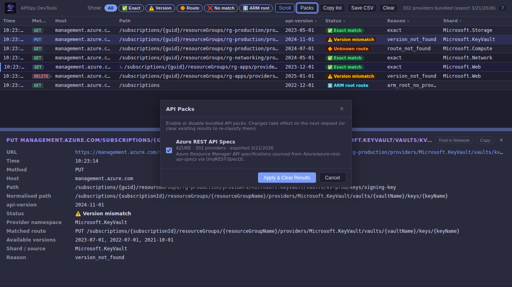

# AP👁️Spy — SpeQL DevTools Extension

AP👁️Spy is the DevTools observer for **SpeQL / SpeQL**.  
It adds a custom panel to Chromium-based browser developer tools that watches outgoing network requests and cross-references them against the bundled SpeQL API inventory.

---

## What does it do?

For every Azure/Microsoft API request observed in the DevTools network inspector, APISpy classifies the request into one of six states:

| Status | Meaning |
|---|---|
| ✅ **Exact match** | Host + method + path template + `api-version` exist in the bundled index |
| ⚠️ **Version mismatch** | Route found, but the requested `api-version` is not in the spec |
| 🔷 **Provider known** | No spec match, but the request is consistent with a provider-declared operation (enrichment match) |
| 🔶 **Unknown route** | Provider namespace is known; route not found in bundled shard |
| ❌ **No spec match** | No provider namespace inferred from the request URL |
| ℹ️ **ARM root route** | Valid ARM endpoint with no provider namespace (e.g. `/subscriptions`, `/tenants`) |

Requests with a recognised provider namespace, plus ARM root routes, are shown in the panel.  
Out-of-scope traffic (non-Azure/Microsoft hosts, URLs with no recognisable provider path) is silently dropped.

---

## Architecture

```
apispy/
├── extension/          ← The unpacked Chrome extension directory
│   ├── manifest.json   ← MV3 extension manifest
│   ├── devtools.html   ← DevTools page entry point (loads lib scripts for sweep processing)
│   ├── devtools.js     ← Registers the APISpy panel; full ARM processing during sweep mode
│   ├── panel.html      ← Panel UI markup
│   ├── panel.js        ← Panel logic: observation, rendering, filtering, pack selection, standalone restore
│   ├── panel.css       ← Panel styles
│   ├── lib/
│   │   ├── filters.js          ← In-scope heuristics (host/URL based)
│   │   ├── normalizer.js       ← Extracts & normalises request fields; supports pack normaliser hooks
│   │   ├── loader.js           ← Pack-aware shard loader (v1.0.0/v2.0.0 manifest, user pack selection)
│   │   ├── matcher.js          ← Classifies requests against the index
│   │   └── azure-enrichment.js ← Azure provider-operation enrichment (optional; gracefully absent)
│   ├── data/
│   │   ├── manifest.json          ← Pack manifest (schema 2.0.0): lists packs + their shards + source metadata
│   │   ├── azure-provider-ops.json ← (optional) Indexed provider-op enrichment data; generated by prepare_provider_ops.py
│   │   └── shards/                ← Per-provider minified JSON shard files
│   │       │                      ← Azure pack shards are in the flat root (backward compat)
│   │       └── <pack-id>/         ← Shards for additional packs go in a subdirectory named after the pack ID
│   └── icons/
│       ├── icon16.png
│       ├── icon48.png
│       └── icon128.png
├── scripts/
│   ├── azure_portal_sweep.py    ← Automated Azure Portal sweep (device code auth + Playwright)
│   ├── provider_ops_sweep.py    ← Enumerates Azure provider operations → azure-provider-operations-<ts>.json
│   ├── prepare_provider_ops.py  ← Converts provider_ops_sweep output → extension/data/azure-provider-ops.json
│   ├── prepare_data.py          ← Extracts shards from any SpecQL-compatible zip/dir; pack-aware
│   └── generate_screenshots.py  ← Generates demos/ screenshots of the extension
├── tests/
│   ├── test_filters.js
│   ├── test_loader.js
│   ├── test_normalizer.js
│   └── test_matcher.js
└── docs/
    └── ADDING_A_PACK.md    ← Step-by-step guide for adding a new API pack
```

### Pack concept

A **pack** is a named set of shards that describes one API platform's surface
(e.g. Azure REST API Specs, a hypothetical AWS pack, an internal API pack).

The manifest (`extension/data/manifest.json`, schema 2.0.0) groups shards by
pack.  Each pack entry carries its own metadata (source repo, commit, timestamp)
and a list of shards.  The loader reads only the shards for the user's enabled
packs, so multiple platforms can coexist without increasing startup cost for
platforms the user doesn't need.

To add a new pack, see **[docs/ADDING_A_PACK.md](../docs/ADDING_A_PACK.md)**.

---

## Automated Azure Portal Sweep

`scripts/azure_portal_sweep.py` automates a full Azure Portal sweep using
Playwright and the APISpy extension.  It authenticates via Azure device code
flow, visits every service on the **All Services** page, and exports all captured
ARM API calls as a CSV file.

**What it produces:**

- `apispy-TIMESTAMP.csv` — every matched ARM request observed across all 305 portal services
- `apispy-sweep-TIMESTAMP.webm` — full browser recording (with `--record-video`)
- `apispy-portal-sweep-browser.gif` — trimmed GIF demo of the browser sweep (if `ffmpeg` is on PATH)

**Quick start:**

```bash
pip install -r requirements.txt
python3 -m playwright install chromium

# Run the sweep (from the repository root)
python3 scripts/azure_portal_sweep.py

# With browser video recording
python3 scripts/azure_portal_sweep.py --record-video --output-dir ./results
```

**How sweep mode works:**

The sweep script sets `apispy_sweep_mode = '1'` in the browser's `localStorage`
before navigation begins.  `devtools.js` detects this flag and, for every ARM
request it intercepts, immediately runs the full Normalizer → Loader → Matcher
pipeline and stores a compact pre-processed entry in `apispy_sweep_entries`.
When the sweep finishes, the script opens `panel.html` in standalone mode; it
reads the pre-processed entries synchronously and renders them — no async shard
loading required.  The net effect is the same real-time processing quality as
normal interactive use, but fully automated.

> For full documentation see [`scripts/PORTAL_SWEEP.md`](../scripts/PORTAL_SWEEP.md).

---

## Screenshots

The following screenshots were captured automatically using the Playwright script
at `scripts/generate_screenshots.py` (headless Chromium, 1280×720).

### Empty state — waiting for requests



### Requests table — mixed classification results

The table shows observed requests spanning all five status types, including
an ARM batch sub-request (↳ row).



### Detail panel — selected row breakdown

Clicking any row opens the detail panel, which shows the full classification
breakdown: matched route key, available spec versions, provider namespace, and
reason code.



To regenerate these screenshots after making changes to the extension:

```bash
# Install dependencies (one-time)
pip install playwright
python3 -m playwright install chromium

# Regenerate — output goes to demos/
python3 scripts/generate_screenshots.py
```

---

## How to load in Chrome / Edge

1. Open **chrome://extensions** (or **edge://extensions**).
2. Enable **Developer mode** (toggle in the top-right corner).
3. Click **Load unpacked**.
4. Select the `extension/` directory.
5. Open DevTools on any page (**F12** or right-click → *Inspect*).
6. You should see a new **APISpy** tab in the DevTools panel bar.
7. Browse to a page that makes Azure/Microsoft API calls and watch results appear.

---

## Panel features

### Status filter pills

The toolbar contains multi-select filter pills: **All** · **✅ Exact** · **⚠️ Version** · **🔷 Known** · **🔶 Route** · **❌ No match** · **ℹ️ ARM root**.  
Each pill can be toggled independently to show only the desired classification(s).  Clicking **All** resets all filters.

### Sort order

The **Sort** dropdown in the toolbar controls the order requests are displayed:

- **Sort: Time** (default) — chronological, newest last
- **Sort: Interesting first** — surfaces provider-known, version mismatches, and high-severity enriched requests before routine exact matches
- **Sort: Highest risk first** — orders by enrichment risk score (requires enrichment data)

### Quick-filter buttons

Three quick-filter buttons narrow the list without replacing the status filters:

- **Interesting** — shows only requests that are provider-known, version-mismatched, high-severity, or unknown-route
- **High risk** — shows only requests with an enrichment risk score ≥ 7
- **Provider known** — shows only `provider_known` classified requests

### Pack selection

The **Packs** button in the toolbar opens the pack settings dialog.  It lists every bundled API pack with its platform, provider count, and export date.  Enable or disable individual packs using the checkboxes, then click **Apply & Clear Results** to save the selection — the loader cache is reset and a fresh sweep begins against the chosen packs.  Your selection is persisted in browser storage across DevTools reloads.



See **[docs/ADDING_A_PACK.md](../docs/ADDING_A_PACK.md)** to learn how to bundle shards for a new API platform.

### ARM batch inspection

`POST management.azure.com/batch` requests are automatically unpacked.  Each sub-request in the batch body is classified independently and shown as an indented `↳` row beneath the parent entry.

### Autoscroll

The **Scroll** button in the toolbar toggles autoscroll.  When enabled, the panel automatically scrolls to the newest row as requests arrive.

### Clear

The **Clear** button in the toolbar removes all observed requests from the panel, resetting the display to the empty state.

### Column-level filters

Each table column header (Method, api-version, Status, Reason, Shard) has a **▾** button that opens a per-column value picker.  Selecting a subset of values restricts the table to rows that match all active column filters simultaneously.  An active column filter highlights the column's **▾** button.  Column filters compose with the status filter pills — only rows satisfying both are shown.

### Detail panel and draggable divider

Selecting any row opens a detail panel below the request list.  The divider bar at the top of the detail panel can be dragged up or down to resize the split.

The detail panel is divided into four sections:

| Section | Contents |
|---------|----------|
| **Observed** | Method, host, raw path, normalised path, api-version, selected pack |
| **Classification** | Status badge, matched route (if any), confidence level (if enriched) |
| **Insight** | Summary title, why it matters, risk class, severity, risk score, capability/risk tags, control-plane bridge flag — only shown when enrichment data matched |
| **Diagnostics** | Per-request pipeline flags (provider inferred, route DB match, enrichment loaded/matched etc.) — collapsed by default |

### Copy to clipboard

- **Copy list** (toolbar) — copies all currently visible rows as tab-separated values (TSV).
- **Copy** (detail panel toolbar) — copies the selected entry's details to the clipboard.

### Save CSV

**Save CSV** (toolbar) downloads all recorded requests as a quoted CSV file with columns including enrichment fields (title, risk score, severity), suitable for offline analysis.

### URL deep link

The full request URL is shown as a clickable link in the detail panel and is included in both CSV and clipboard exports.

### Find in Network

The **Find in Network** button in the detail panel toolbar copies the request URL to the clipboard and displays guidance:  
> *URL copied — open the Network panel, press Ctrl+F (Windows/Linux) or Cmd+F (macOS) and paste to locate this entry.*

### Shard load error surfacing

If a provider shard fails to load at runtime, the affected entry is shown as a red **Load error** row in the detail panel, with `reason: "shard_load_failed"` and an `error` field describing the cause.

---

## How the static bundled index works

The extension ships with pre-extracted shard files in `data/shards/`.  
These are `.min.json` files derived from the SpeQL grouped/sharded export
(`api-index-grouped.json`, schema 3.0.0), one file per Azure provider namespace.

A top-level `data/manifest.json` is read once on startup.  When a request arrives
for a provider like `Microsoft.Storage`, only the `Microsoft.Storage.min.json`
shard is fetched — nothing else is loaded.  Shard lookup tries an exact-case match
first, then falls back to a case-insensitive search.

All 302 available provider shards are bundled; there is no size cap.

### Re-bundling shards

To re-populate from a fresh SpeQL export (Azure pack):

```bash
# From the repository root — requires the sharded zip in inventory/
python3 scripts/prepare_data.py --zip inventory/api-index-sharded-<run-id>.zip
```

To add or refresh a different pack without overwriting the Azure pack:

```bash
python3 scripts/prepare_data.py \
  --source-dir /path/to/other-pack/ \
  --out extension/data/ \
  --pack-id "my-api-pack" \
  --pack-name "My API Pack" \
  --platform "other" \
  --merge
```

See **[docs/ADDING_A_PACK.md](../docs/ADDING_A_PACK.md)** for the full guide.

---

## Running the tests

The unit tests for `filters`, `normalizer`, `loader`, and `matcher` run in Node.js (no
additional packages required).

```bash
# From the repository root
node tests/test_filters.js
node tests/test_loader.js
node tests/test_normalizer.js
node tests/test_matcher.js
```

---

## Azure Provider-Operation Enrichment

When `extension/data/azure-provider-ops.json` is present, APISpy adds a second classification layer for Azure ARM requests — matching observed requests against provider-declared operation metadata beyond what the spec shards cover.

### What it provides

For any request that isn't an exact spec match, the enrichment layer attempts to:
- Infer the provider namespace, resource path, action name, and suffix kind from the raw ARM path
- Look up the inferred parts in the enrichment index
- Assign a confidence level (high / medium) to the match
- Return insight data: summary title, why-it-matters explanation, risk score, severity, capability/risk tags, and a control-plane bridge flag

If a high- or medium-confidence match is found and no exact spec match exists, the request is reclassified as **🔷 Provider known**.

### Generating the enrichment data

```bash
# Step 1 — enumerate provider operations (requires Azure credentials)
python3 scripts/provider_ops_sweep.py

# Step 2 — convert to the indexed extension format
python3 scripts/prepare_provider_ops.py
#   → writes extension/data/azure-provider-ops.json

# Step 3 — commit the file so the extension can load it
git add extension/data/azure-provider-ops.json
git commit -m "chore: update azure provider-ops enrichment data"
```

`provider_ops_sweep.py` authenticates via Azure device code flow and enumerates all provider operations across all accessible subscriptions.  Run it periodically (e.g. after major Azure API changes) to refresh the enrichment data.

### Fallback behaviour

If `azure-provider-ops.json` is absent or fails to load, the enrichment module initialises silently and all enrichment code paths are skipped.  The extension falls back to standard spec-shard classification with no degradation in existing functionality.

---

- **Path template matching for non-ARM APIs.**  
  For Azure Resource Manager URLs the normalizer applies structural ARM rules:
  subscription/resource-group/tenant/location/management-group scope segments are
  replaced with canonical placeholders, and name-position segments within the
  provider resource path are replaced with `{name}`.  This significantly reduces
  false *Unknown route* results for ARM paths.  However, non-ARM API paths (e.g.
  Microsoft Graph `v1.0/…` paths) only receive basic normalisation (GUID and
  pure-integer segment replacement), so many Graph routes still appear as
  *Unknown route* even when the provider shard is bundled.

- **No background sync.**  
  The bundled index is a point-in-time snapshot.  There is no automatic update
  mechanism.

- **Graph and non-ARM APIs.**  
  `graph.microsoft.com` is recognised as in-scope, but the bundled index currently
  covers Azure Resource Manager (`management.azure.com`) exclusively.

---

## Future planned enhancements

1. **Remote artifact updates** — pull latest shards from GitHub Pages / artifact store.
2. **Graph API support** — add Microsoft Graph spec shards.
3. **Export timestamp display** — show index freshness in the panel.
4. **Filter persistence** — remember the last-used filter across panel opens.

---

## Relationship to SpeQL / SpeQL

- **SpeQL** — the repository and export pipeline that produces the API inventory.
- **SpeQL** — the query engine used to analyse the Azure REST API spec corpus.
- **APISpy** — this extension; the DevTools consumer of the SpeQL static export.

APISpy does **not** modify the SpeQL export pipeline.  It consumes the
already-produced output files.

